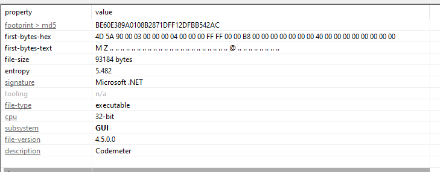
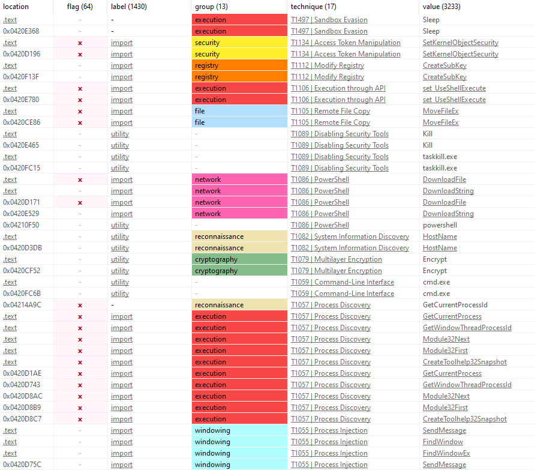
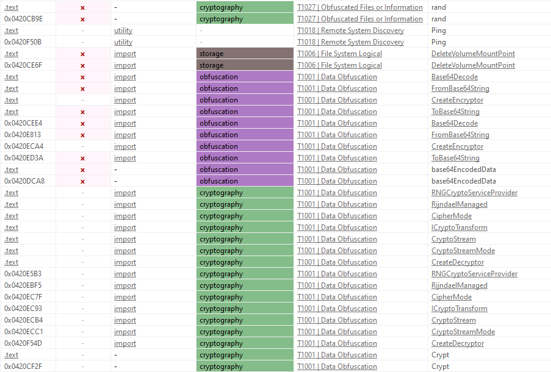
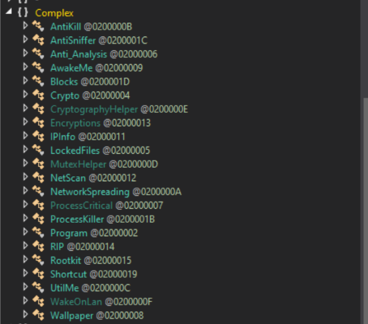
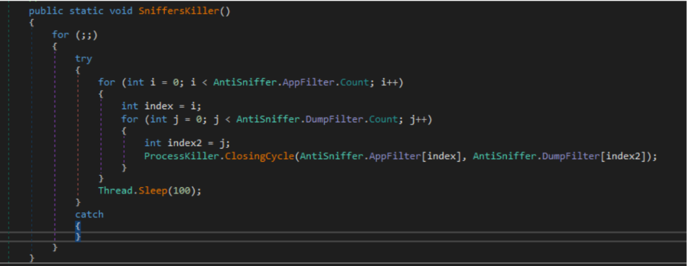
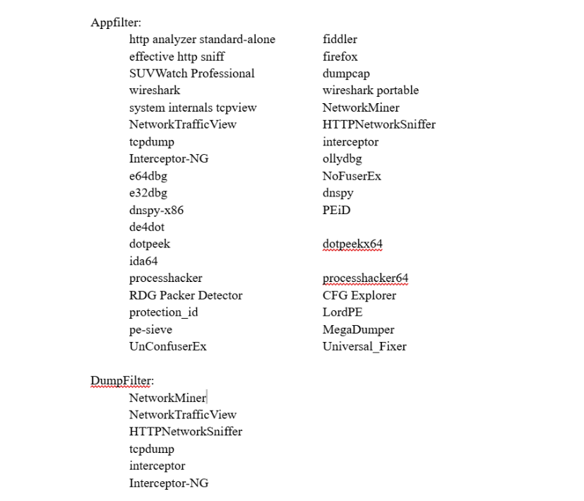

# Thanos.Ransomware

## **1. Thông tin chung về mã độc Thanos.Ransomware**
\- **Tên mã độc:** Thanos.Ransomware

\- **Loại mã độc:** Ransomware

\- **Ngày phát hiện:** 2020-06

\- **Source:** [Thanos Github](https://github.com/kh4sh3i/Ransomware-Samples/blob/main/Thanos/Ransomware.Thanos.zip)

## **2. Phân tích Tĩnh**
**Xác định thuộc tính file:**
-
- Header 4D 5A (MZ) -> PE file
- 32 bit
- Framework .NET
- có thể nó sẽ giả dạng tiến trình codemeter.exe
- File size : rất nhỏ so với tiến trình codemeter thực ( ~ 15MB so với 91 kb)

**Phân tích hash:**
-
- Ta thu được mã hash. Khi có mã hash, ta có thể tìm kiếm trên cơ sở dữ liệu (virustotal) để xem file này có phải là mã độc đã được phát hiện hay chưa.

**Phân tích string:**
-
=> Mã độc sử dụng các kỹ thuật như phát hiện sandbox, chèn mã vào tiến trình, tương tác với powershell và chạy cmd.exe để thực thi lệnh.
- Ta thấy có nhiều chuỗi liên quan đến việc tương tác với powershell và chạy cmd.exe để thực thi lệnh. Điều này cho thấy mã độc có thể sử dụng các lệnh powershell và cmd.exe để thực hiện các hoạt động khác nhau, chẳng hạn như thu thập thông tin hệ thống, tải xuống và thực thi các tập tin độc hại, hoặc thực hiện các hoạt động khác như mã hóa dữ liệu hoặc thực hiện các cuộc tấn công mạng.

- Nó còn bao gồm các hàm liên quan đến mã hóa như **Base64Decode**, **CipherMode**, ... Có thể dự đoán được rằng mã độc sử dụng các kỹ thuật Obfuscation và Encryption để ẩn các hoạt động của nó và bảo vệ mã nguồn khỏi phân tích. Đây có thể là một loại mã độc mã hóa dữ liệu đòi tiền chuộc.

**Phân tích mã nguồn:**
- 
- Mã đọc sử dụng framework .NET để đóng gói và thực thi. Ta có thể sử dụng dnSpy để phân tích mã nguồn của nó. Thấy được danh sách class:

    

- Tổng quan các hàm có thể thấy được chương trình đang thực hiện hành vi liên quan đến lock file và mã hóa, có thể có khả năng lan truyền qua mạng và có thể chống lại được các hành vi phân tích.

- Tìm kiếm hàm Main và thấy nó nằm trong class Program. Ta có thể xem xét các hàm được gọi trong hàm Main để hiểu rõ hơn về hành vi của mã độc.

- CheckMutex sẽ kiểm tra xem một Mutex có tồn tại hay không. Nếu Mutex tồn tại, chương trình sẽ kết thúc ngay lập tức. Điều này có thể được sử dụng để ngăn chặn mã độc chạy nhiều lần trên cùng một máy tính.

    

- **SniffersKiller** sẽ kill hết các tiến trình theo dõi mạng như wireshark, fiddler, ... Điều này có thể được sử dụng để tránh bị phát hiện khi mã độc thực hiện các hoạt động mạng bất hợp pháp. Nó kiểm tra và nếu đúng điều kiện thì khởi tạo 1 tiến trình ngầm với mức ưu tiên thấp để chặn các phần mềm trong list.
    
    

- Ở đây ta có 2 list là **AppFilter** và **DumpFilter**, đi vào ta có được list danh sách bị mã hóa bằng base64, decode ra và thu được:

    
